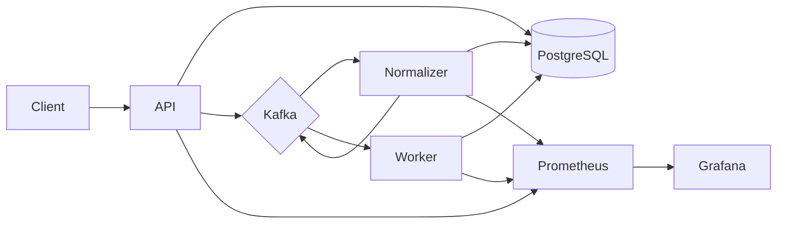

# Agent Trace Replay Platform

## Project Overview

When AI agent workflows fail in production, logs show what happened but make it hard to **re-run the same tool-call sequence** under controlled conditions. This backend ingests agent traces, stores them in PostgreSQL, and publishes events through Kafka so downstream services can compile replay manifests and execute mock dependency replays with synthetic failures (timeouts, HTTP errors, malformed responses).

Right now the ingest API, database schema, Kafka pipeline, and observability stack are in place. I'm still building out the normalizer, replay worker, and failure injection paths.

## Technology

This project uses a number of open-source tools:

- [FastAPI] - REST API and Prometheus metrics endpoint
- [PostgreSQL] - trace and replay persistence
- [Apache Kafka] - event pipeline between services
- [Prometheus] - metrics collection
- [Grafana] - dashboards
- [Docker Compose] - local multi-service stack

## Architecture



Ingest and persistence are live today. The normalizer and replay worker paths are still being built.

## Installation

**Agent Trace Replay** was built with [Docker](https://www.docker.com/) and Docker Compose. Verify Docker is installed:

```sh
docker version
```

From the project root:

```sh
cp .env.example .env
docker compose up --build
```

| Service    | URL                          |
|------------|------------------------------|
| API        | http://localhost:8000        |
| Health     | http://localhost:8000/health |
| Readiness  | http://localhost:8000/ready  |
| Prometheus | http://localhost:9091        |
| Grafana    | http://localhost:3000 (admin/admin) |

## Usage

Ingest a sample trace:

```sh
curl -X POST http://localhost:8000/v1/traces/ingest \
  -H "Content-Type: application/json" \
  -d @fixtures/sample_ingest.json
```

Fetch a trace by ID:

```sh
curl http://localhost:8000/v1/traces/trace_demo_refund
```

Run unit tests locally:

```sh
pip install -e ".[dev]"
PYTHONPATH=src pytest tests/ -m "not integration"
```

## Sample output

Ingest response (`POST /v1/traces/ingest`):

```json
{
  "trace_id": "trace_demo_refund",
  "accepted": 2,
  "duplicates_ignored": 0,
  "status": "accepted"
}
```

Trace lookup (`GET /v1/traces/trace_demo_refund`):

```json
{
  "trace_id": "trace_demo_refund",
  "agent_run_id": "run_001",
  "source": "demo",
  "status": "open",
  "events": [
    {
      "sequence": 1,
      "event_type": "tool_call",
      "tool_name": "customer_lookup",
      "status_code": 200,
      "latency_ms": 80
    },
    {
      "sequence": 2,
      "event_type": "tool_call",
      "tool_name": "order_lookup",
      "status_code": 200,
      "latency_ms": 95
    }
  ]
}
```

A replay walkthrough GIF will go here once the worker and failure injection paths are wired up.

## Final Thoughts

This is still a work in progress. The target use case is debugging agent failures, for example, a refund support trace where `refund_policy` times out, a retry returns malformed JSON, and the workflow fails downstream. Once replay is wired up, the goal is to reproduce that first failing dependency step on demand.

See [docs/LIMITATIONS.md](docs/LIMITATIONS.md) for what the platform does not do.

[FastAPI]: https://fastapi.tiangolo.com/
[PostgreSQL]: https://www.postgresql.org/
[Apache Kafka]: https://kafka.apache.org/
[Prometheus]: https://prometheus.io/
[Grafana]: https://grafana.com/
[Docker Compose]: https://docs.docker.com/compose/
