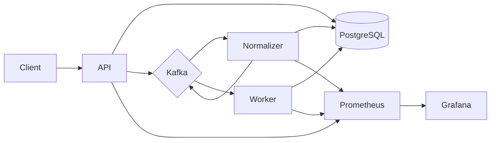

# Agent Trace Replay Platform

## Project Overview

When AI agent workflows fail in production, logs show what happened but make it hard to **re-run the same tool-call sequence** under controlled conditions. This backend ingests agent traces, stores them in PostgreSQL, and publishes events through Kafka so downstream services can compile replay manifests and execute mock dependency replays with synthetic failures (timeouts, HTTP errors, malformed responses).

## Technology

This project uses a number of open-source tools:

- [FastAPI] - REST API and Prometheus metrics endpoint
- [PostgreSQL] - trace and replay persistence
- [Apache Kafka] - event pipeline between services
- [Prometheus] - metrics collection
- [Grafana] - dashboards
- [Docker Compose] - local multi-service stack

## Architecture



## Installation

**Agent Trace Replay** was built with [Docker](https://www.docker.com/) and Docker Compose. Verify Docker is installed:

```sh
docker version
```

From the project root:

```sh
cp .env.example .env
docker compose up --build
```

| Service    | URL                          |
|------------|------------------------------|
| API        | http://localhost:8000        |
| Health     | http://localhost:8000/health |
| Readiness  | http://localhost:8000/ready  |
| Prometheus | http://localhost:9091        |
| Grafana    | http://localhost:3000 (admin/admin) |

## Demo

With the stack running, load three multi-step agent scenarios (refund support, checkout, knowledge assist) and run clean + failure-injection replays:

```sh
# Linux / macOS / Git Bash
bash scripts/demo.sh

# Windows PowerShell
./scripts/demo.ps1
```

Demo fixtures live under `fixtures/demo/` (10-step refund path, 8-step checkout, 6-step knowledge assist).

Then open Grafana at http://localhost:3000 (`admin` / `admin`) and look for **Agent Trace Replay - How to read the platform**. The top of that dashboard explains traces, replays, steps, and each chart in plain language.

## Usage

Ingest a sample trace:

```sh
curl -X POST http://localhost:8000/v1/traces/ingest \
  -H "Content-Type: application/json" \
  -d @fixtures/sample_ingest.json
```

Fetch a trace by ID:

```sh
curl http://localhost:8000/v1/traces/trace_demo_refund
```

Fetch the compiled replay manifest:

```sh
curl http://localhost:8000/v1/traces/trace_demo_refund/manifest
```

Start a deterministic replay:

```sh
curl -X POST http://localhost:8000/v1/replays/ \
  -H "Content-Type: application/json" \
  -d '{"trace_id":"trace_demo_refund","failure_injection":false}'
```

Start a replay with failure injection (`timeout`, `http_500`, `malformed_json`, `slow`):

```sh
curl -X POST http://localhost:8000/v1/replays/ \
  -H "Content-Type: application/json" \
  -d @fixtures/sample_replay_inject.json
```

Fetch replay status:

```sh
curl http://localhost:8000/v1/replays/<replay_id>
```

List recent replays (optional `?trace_id=` and `?status=`):

```sh
curl "http://localhost:8000/v1/replays/?limit=10"
curl "http://localhost:8000/v1/traces/trace_demo_refund/replays"
```

Open Grafana at http://localhost:3000 (`admin` / `admin`) and open **Agent Trace Replay - How to read the platform** (glossary + chart explanations are on the dashboard itself).

## Tests

```sh
pip install -e ".[dev]"
PYTHONPATH=src pytest tests/ -m "not integration"
```

Integration and golden e2e tests need the Compose stack up:

```sh
PYTHONPATH=src pytest tests/ -m integration
```

## Sample output

Ingest response (`POST /v1/traces/ingest`):

```json
{
  "trace_id": "trace_demo_refund",
  "accepted": 2,
  "duplicates_ignored": 0,
  "status": "accepted"
}
```

Failure-injection replay summary (from `scripts/demo.ps1` / `scripts/demo.sh`):

```text
status:     failed
first fail: span_1
steps:
  - #1 span_1: failed (timeout)
  - #2 span_2: failed (malformed_json)
```

## Final Thoughts

I built this to practice event-driven backends with Kafka and a honest mock-based take on replaying agent tool-call failures. The demo path reproduces a refund-style failure under controlled injection - not full LLM determinism.

See [docs/LIMITATIONS.md](docs/LIMITATIONS.md) for what the platform does not do.

[FastAPI]: https://fastapi.tiangolo.com/
[PostgreSQL]: https://www.postgresql.org/
[Apache Kafka]: https://kafka.apache.org/
[Prometheus]: https://prometheus.io/
[Grafana]: https://grafana.com/
[Docker Compose]: https://docs.docker.com/compose/
